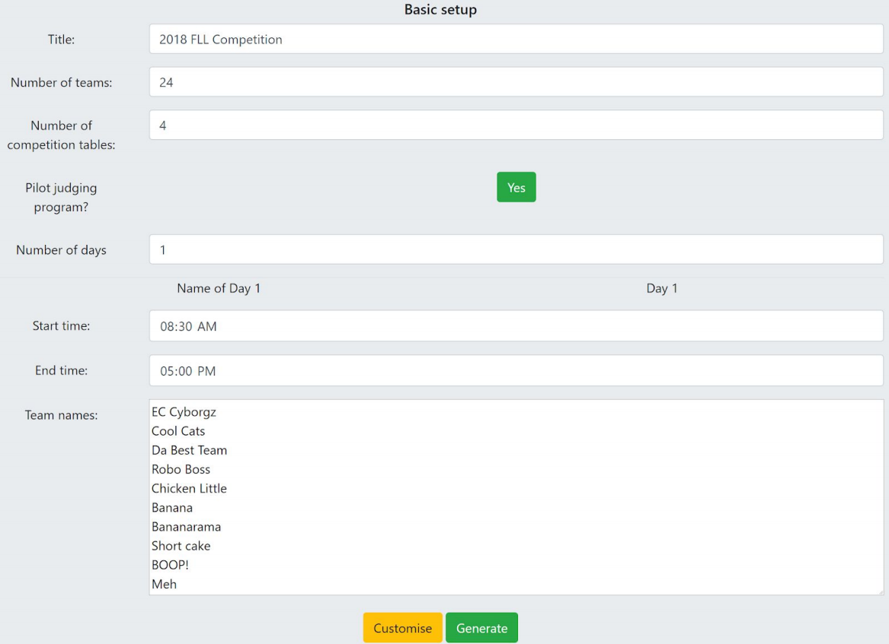
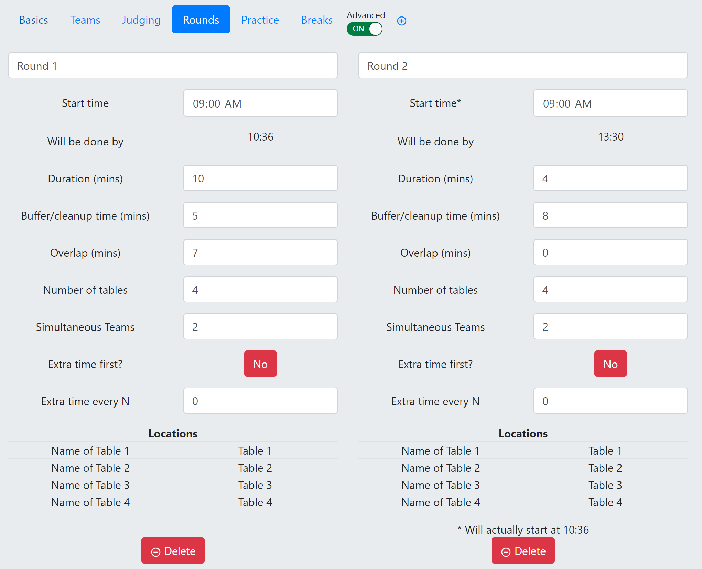

1. [ Changelog ](#changes)
2. [ Introduction ](#intro)
3. [ Schedule Generation ](#gen)
4. [ Output ](#output)
5. [ Tips & Tricks ](#tips)
6. [ Troubleshooting ](#trouble)

# 1. Changelog
## Version 3.4.2
* Default team affiliation set to team number
* Added comma or tab delimited team input
* Fixed bug relating to tabs in team names
* Fixed a bug in schedule file loading
* Tied locations together for matches and practice rounds.

## Version 3.4.1
* Renamed "pit no" to "affiliation" to bring it in line with the FLL Tournament Management System

## Version 3.4.0
* Added "overlap" field to make matches with multiple tables work better.
* Fixed bug in travel time reporting.
* Updated algorithm for populating tournament at the start.

## Version 3.3.3
* Edited individual schedule output format to make it possible to copy it somewhere else as a table.

## Version 3.3.2
* Updated the manual to be a github README
* Fixed a bug in save file generation (filename related)

## Version 3.3.1
* Forces download of CSV and savefile when downloading PDFs; CSV is necessary for scoring system and savefile is necessary if you need to edit anything so now you have to actively decide to delete them.

## Version 3.3.0
* Added two new PDFs: Daily schedule and team list.

## Version 3.2.0
* Fixed CSV generation so it correctly imports into the new scoring system.

## Version 3.1.2
* Under pilot judging, lunch is now scheduled to be after robot round 1 finished.
* Redefined the rules for automatically generating match times.

## Version 3.1.1
* User defines how many competition tables they have from the beginning.
* Round 1 is now minimum (30/# tables) minutes long, to give time for robot design judging.

## Version 3.1.0
* Added the option to swap teams around in the final schedule.

## Version 3.0.2
* Added a selector switch for judging pilot mode (no CV or RD judging) to enable traditional scheduling; True by default for Australian tournament directors.
* Made Round 1 matches run slightly faster, to provide more of a buffer at the end of the day.

## Version 3.0.1
* Added issue tracker
* Added “email developer” link
* Added tooltips for info menu

## Version 3.0.0
* Complete overhaul of web-based scheduling software to run on a more reliable code structure.

# 2. Introduction

## History
An important part of any _FIRST_ LEGO League (FLL) tournament is the schedule.  It ensures that each team gets to partake in the entire tournament, and without a well-crafted one the tournament will inevitably descend into chaos.

There are many ways to generate a schedule, the simplest being to manually list out teams for each aspect of the tournament (robot rounds, judging, etc).  However, it can be difficult to avoid scheduling errors when doing this manually.  If a team is scheduled to be in two places at once, problems can happen!  When a tournament is more than 10 teams, manual scheduling takes a great deal of thought, effort and error checking to figure out.  Automated methods make this much simpler.

US _FIRST_ provides an Excel-based system for FLL partners to use for tournament scheduling.  They provide standard schedule layouts for a variety of common tournament setups, which can be compiled into a number of useful formats to use during the competition.  This system can be used, but is not very flexible and can be hard to use for non-standard tournaments.

Due to these considerations, we have developed a new FLL tournament scheduling software.  This web app is designed to be effective and easy-to-use for simple or complex tournaments, while also allowing extensions and variations that may be desired.

The current version of the software is the 3rd major release.  The first release was used by FIRST Australia to schedule their local tournaments, while the second was given to tournament directors around the country.  Their experiences and feedback have been used to inform the latest version, and any constructive experiences or feedback discovered in the 2018 season will be used for continual improvement.

## Standard Terms
A standard FLL tournament consists of three basic elements:
* **Robot rounds**: Every team must play on the official competition field three times.  Competition tables come in pairs, so multiples of two teams should compete at a time.
* **Judging**:  There are three types of judging at an FLL tournament: Robot Design, Core Values and Research Project.  Each team must visit each type of judging panel once during the tournament.  Typically, a tournament will have 2-4 judging panels in each area, depending on the number of teams.  For Australian tournaments in 2018, we are piloting having only Research Project judging be scheduled, with the other two involving judges moving around to talk to teams at will.  This document, as well as the default settings in the scheduler, reflect this pilot program.
* **Breaks**: Each tournament should have an Opening Ceremony, a Closing & Awards Ceremony and a lunch break, though other breaks can be added depending on time.

## Typical generated day schedule
When you generate a schedule (getting ahead of ourselves a little), the system will make you a “day schedule” in a sidebar.

This lists out the various activities that will happen during the day, and the times associated.  A typical example is shown below.

## Saving your progress
At the top of the page, there are a few controls.  The info menu provides some options for understanding or providing feedback, but the other two allow you to save your schedule or load a previous one.

Wherever you are in the schedule generation process, you can press the Download button to download a .schedule file.  For instance, you can (early in the season) generate a schedule with your estimated number of teams to make sure you have your parameters right, then load it closer to the competition and change team names.

Note that if you edit the downloaded file at all, it will likely fail when you load it.  Furthermore, if the scheduler is updated after you save it, it may not load correctly (however, you will be given a warning if the version you saved is older than the current version).

# 3. Schedule Generation

## Initialisation
If you are running a standard tournament, are flexible in the number of tables and judging panels) and do not have specific requirements, this mode should work for you.

When you open the scheduler, you’ll see an interface to select basic tournament settings.  These settings define the basic framing of the tournament.  They are, in order:
* **Tournament title:** What your tournament should be known as; for example, “Melbourne FLL Regional 2018” or “Wooloowin Regional”.
* **Number of teams:** How many teams are registered for your tournament; If this is a regional tournament, FIRST Australia recommends adding some number of “spares” or “stand-ins”, in case there are late registrants, or unexpected teams arrive.  Generally, schedules generate  better if there are an even number of teams, so add 1, 2 or 3 extras.
* **Pilot judging program:** If your tournament uses the 1 scheduled judging session model, this should say “Yes” and you will not be given a Core Values or Robot Design Schedule; if “No”, all three judging types will be scheduled.
* **Number of competition tables:** How many tables can you have set up?  Note: This will also need to match your number of robot design judging panels, by default.
* **Number of days:** If you are running a 2- or 3-day tournament, change this value; standard tournaments should not need to change this.
Day names: Only to be used for multi-day tournaments, specify what the days are called.  E.g. “Day 1 / Day 2”, “Fri / Sat / Sun”, “4th / 5th”, etc.  For single day tournaments, this will not affect anything.
* **Start time / End time:** What time the tournament starts and ends.  By default, a half-hour opening and closing ceremony will be added, so if you want matches and judging to start at 9:00 AM, start time should be 8:30 AM.
* **Team names:** Here, add your list of team names.  This can be a simple list, or a tab-delimited or comma-delimited table.  In the case of a delimited table, each line should either be "number,name" or "number,name,affiliation".  If you have added any number of stand-ins, remember to add their names as such.
At this point, press “Generate” and move on to  “Output”.

## Customisation
When you specify the basic tournament settings, the scheduler attempts to select other settings for you to make the schedule work.  However, this will not work for everyone.  If you need to customise the default schedule choices, here are the menus you will be using.

There are six tabs in the Customisation screen.  Each controls a different aspect of the tournament, and there are “advanced” features in each as well.  We do not recommend you activate “Advanced” mode unless you need to and know what you’re doing, but all standard and advanced controls are described here.

### Basics
The Basics tab specifies the tournament details.  There are, by default, three settings in this section:
* **Title:** Same as the setting in the original screen.
* **Minimum travel time (minutes):** It’s generally unreasonable to expect teams to have a match starting at the same time as their judging session finishes, and this is a really easy way to have a schedule run late with grumpy teams.  Instead, we add a buffer time to allow teams to travel between different events.  10 minutes is the default, though you should try to increase this as much as possible while still successfully scheduling.  If the schedule is failing to generate, lowering this number might help (especially if judging and robot matches are close to each other). 
* **Day names:** In a single-day tournament, this control is not necessary.  In a multi-day tournament, this sets how the days are referred to.

Advanced features:
* **Extra time (mins):** This control is only used if you add “extra time” to any team, match, or judging session.  When you add extra time, the number specified here is the one used.  For example, if Team #4 needs extra time (e.g. the students do not speak English and need a translator) and you specify this in the Teams tab, then they will be given 5 minutes extra (in this case).

### Teams
In the Teams tab, you set the details of each individual team.  You can also add/delete teams.  The main table grid in this tab is an embedded spreadsheet, so you can copy whole columns to/from an Excel spreadsheet or similar.
* **Add teams:** Set the number to decide how many teams to add, then press the “Add” button.
* **Team number:**  Each team is assigned a tournament-specific team number, as a shorthand to uniquely identify them.  Generally, the system-generated ones are sufficient.
* **Team name:** Each team should have a unique name.
* **Pit number (now Affiliation):** This is a value used in the FLL Scoring System, but does not need to be set for most tournaments; feel free to ignore this.
* **Delete team:** Press the red delete button to remove a particular team.

In advanced mode, four extra fields are provided.  These fields cannot be edited directly from the table, but if you press the “Edit…” button you can change them through the “Advanced Edit” modal.
* **Exclude from judging?** Teams sometimes need to be excluded from judging.  You can do this with stand-in teams, or teams that do not qualify for awards.
* **Extra time needed?** This should be activated if a team has a known issue that may require them to spend longer in judging and matches.  Reasons for this may include, but are not limited to: the team doesn’t speak English and requires a translator; members of the team are severely on the Spectrum and may need extra time to interact with volunteers; members of the team require extra time to travel between rooms and enter rooms (e.g. crutches, wheelchairs).
* **Arrives:** The team will be arriving at a particular time and all sessions must be later than this.  If empty, it is assumed they arrive in time for the first scheduled session.
* **Leaves:** The team must leave by a particular time and all sessions must be earlier than this.  If empty, it is assumed they stay until the last scheduled session.

### Judging
In the Judging tab, you can control the parameters associated with judging.
* **Start time:** When should the first judging session start?
* **Will be done by:** Not editable, this tells you when the last judging session will finish
* **Duration (minutes):** How long the actual session is; i.e. how long the team is with the judges.  This is recommended to be 10 minutes and should not be changed unless you have good reason and prior approval.
* **Buffer/cleanup time (mins):** Time in between one team leaving and the other walking in.  5 minutes is a good balance between finishing quickly and judges having time to get themselves in order.  Less than 5 minutes means the judges will probably be too rushed, while more than 15 minutes means the judges will get restless (and the day may run too long).
* **Number of rooms:** How many judging panels are available?  A general rule of thumb is that you should have one judge panel for every 10-12 teams.
* **Location names:** Change these to help teams find where to go.


Judging tab advanced features:
* **Add judging:** The plus sign next to “Advanced” allows you to add another judging session if you need to.  This should not be necessary for 2018 regional tournaments, but you can add in scheduled Core Values or Robot Design judging as needed.
* **Judging name:** In Advanced mode, the name of the judging can be changed, though this usually is not necessary.
* **Extra time first?** This adds extra time to the first judging session.  You can use this to give your judges an easier start to the day, as they reflect and plan for the other teams..
* **Extra time every N:** This adds extra time to every N judging sessions (specified).  If it fits in the schedule, this can help the judges feel more comfortable, as they can take a quick break, get a coffee, etc.  Keeping your volunteers happy is an important job as tournament director!
* **Delete round:**  You can delete any judging set. Generally, don’t bother unless a non-standard tournament.

### Rounds
In the Rounds tab, you can control the parameters associated with robot rounds.
* **Start time:** When should the first match of this round start? *NOTE: Rounds **cannot** overlap, so the round will start at whichever is later: the listed start time, or the end of the last match of the previous round.  This time is listed at the bottom of the round (in this case, 11:12).
* **Will be done by:** Not editable, this tells you when the last match of the round will finish
* **Duration (minutes):** How long the actual match is; i.e. how long the team is at the table.
* **Buffer/cleanup time (mins):** Time in between one team leaving and the other walking in.  This time will cut into a team’s travel time, as it’s specifically for the volunteers to clean up between matches.
* **Overlap (mins):** Amount of "stagger" when using multiple tables.  If set to a non-zero number, matches will start during the buffer time of previous matches.
* **Number of tables:** How many tables are there?  This should always be a multiple of 2, as tables need to be back-to-back.
* **Simultaneous teams:** How many teams compete at any one time?  This should also be a multiple of 2.  If this is set to 2, matches are “staggered” (they alternate between which tables get played), while if it’s set to the same number as tables, you can run multiple pairs of teams at once, but probably need a bigger buffer time to clean up.  Generally, staggered is the best approach so leave this at 2.
* **Location names:**  Change these if your tables have names; for instance, if the tables are coloured it will help the volunteers and teams find them if you change them here.  Note that changing the location names for any Round or Practice round changes it for all of them; at the moment, there's no way to run different rounds on different tables.


Rounds tab advanced features:
* **Add round:** The plus sign next to “Advanced” allows you to add another round if you need to.  This should not be necessary generally, as three rounds is recommended by FLL.
* **Round name:** In Advanced mode, the name of the round can be changed, though this usually is not necessary.
* **Extra time first?** This adds extra time to the first match of the round.  You can use this to give your field volunteers an easier start to the day.
* **Extra time every N:** This adds extra time to every N rounds (specified).  If it fits in the schedule, this can help the field volunteers keep on time throughout the day.  Typically, not necessary.
* **Delete round:**  You can delete any round.  Generally don’t bother unless a non-standard tournament.

### Practice
The Practice tab is exactly like the Rounds tab, except rounds defined in this way are separate in schedule and scoring system as they do not count towards a team’s score.

### Breaks
In the Breaks tab, you can edit any of the scheduled breaks.  Breaks apply to all teams, and by default will interrupt all scheduled sessions.
* **Start time:** When does the break start?
* **Will be done by:** Specify the time the break ends.
* **Break applies to…:** Opens the modal shown on the right; you can specify which scheduled events the break applies to.  For instance, if you want to give your judges a half-hour break but the robot rounds don’t need a break, unselect “All” and select all three judging sessions.

Advanced break features:
* **Add break:** The plus sign next to Advanced lets you add new breaks.
* **Change break name:** If you add a new break, you may wish to change the name of any or all of the breaks.
* **Delete:** Delete any breaks you don’t need.

# 4. Output
Upon generating a schedule, you will be presented with the details of the generated schedule, as below.  In the left sidebar, there is a button to take you back to the Customisation screen (note: the schedule details will be erased if you do this, so download a copy if you want to get back there).  There is also an estimated day schedule as described earlier in this document.

If any errors occurred in scheduling, a message will pop up at this stage.  In this case, you do not want to use the schedule as some teams will not do everything.  Press the “Change parameters” button, at which point you can either edit your parameters to make the schedule more doable or re-generate and hope it works (there is a random element to generation, so if it fails, that doesn’t mean it always will).

There are three sections to the output window, explained below.

## Session schedules tab
As shown in the above image, the **Session schedules** tab shows the individual schedule of each aspect of the competition (except for breaks).  All of the tables are in an embedded spreadsheet format, so you can copy the table across to another document if you want to edit or format it.

If an “X” is shown instead of a team number in any of the schedules, this means an error in scheduling was made.

In this tab, take a close look at things to ensure it looks like you need it.  If anything in the Session schedules or the Day schedule is incorrect, go back to Customisation.

### Swapping Teams
As of v3.1.0, you can swap teams in the schedule.  Simply switch on “Editable”, then click on two teams that you wish to swap.  If both teams can do this swap, they will; otherwise, the system will tell you which team has a problem.  The usual reasons you might swap teams include (a) to prevent one judge panel from seeing all the “stand-in” teams, (b) in cases of conflict of interest, or (c) if you want teams known to be good distributed in a certain way.

## Individual schedules tab
The **Individual schedules** tab (shown below) shows the schedule for each team individually.  As with Session schedules, this table is an embedded spreadsheet which can easily be copied across to a document if needed.

## Generate Outputs tab
This tab allows you to download the schedule in different formats.  If you press either “Go!” button, you will be asked to provide a file name and then the files will be downloaded.  Three file types will be downloaded:

The SCHEDULE format is a save file for the schedule; you can load it back into the scheduler later if you want to edit the schedule without regenerating from scratch.

The CSV format is used for importing into the FLL scoring software so you can score the matches during the day..

The PDF format includes multiple commonly used tournament print-out documents, described in the following section.  The **Edit format…** button allows you to change some of the visual aspects of these PDFs.

As stated earlier, you can use the table views in the Session schedules and Individual schedules tab to manually generate document printouts that look however you like; these PDF outputs are simply a quick and easy way to make printouts that work for pretty much any tournament.

If you enter the **Edit PDF Format** dialog (shown below), you can change multiple aspects of the downloaded PDF.  However, it is perfectly fine to use without editing these.

There are two font sizes that can be edited: The **Title font size** controls the size of page and table headers.  The **base font size** controls the size of page content font.  These should only really be changed if there is text overlap due to overly long team names or tournament titles.

There are four logos on the page, one in each corner.  These can be edited by clicking on them to upload new files.  We recommend using JPG or PNG files, though other types may work.  If the PDF output fails, there may be an issue with your custom logos/images.

### PDF Outputs
Typically, when you download PDF’s, Six files will be downloaded (you may need to authorise the page to download multiple files):
* **Judging schedules:** Typically, this document would be printed to hand to the judges so they can keep track of which teams they will see and when.
* **Match schedules:** Like the judging schedules, all robot round schedules are in the same document.  Print out copies of this document to hand out to referees and queuing staff.  If you have practice rounds in your schedule, you will also get a version of this document just for the practice rounds.
* **Individual schedules:** On each page of this document is the schedule for the individual teams; print out one copy of this document for the whole tournament, and give each team their specific page so they know when and where to go.
* **All team schedules:** This document lists all teams and their individual schedules in a few pages.  While this is not strictly necessary for anyone, it is a useful printout for the pit admin staff, queuing staff and tournament directors, as it allows them to see the whole tournament at a glance, and see where teams should be at any time.
* **Day schedule:** The same output as in the sidebar, on the official template.
* **Team list:** List of all teams and their associated number, on the official template.

# 5. Tips & Tricks
Here are a few assorted suggestions from many years of generating FLL schedules:

## How should I go about selecting my parameters?
* Start with the ones you have no control over; if your tournament is on a school day, it may have to be between 9:30 AM and 2:30 PM, for instance.  Also, if you only have two FLL tables built, you can’t have 4 competition tables.  Set all these parameters first, to help you control the ones you can change.
* Understand the balances at play; for instance, the schedule is easier to generate and easier to keep on time if you have big buffer times, but this will also make it run later.  Similarly, adding lots of judging panels and competition tables makes the schedule simpler, but you’ll need more space, more volunteers and more resources.
* Keep your volunteers in mind, as they have to actually implement this schedule.  We suggest no more than 12 teams per judging panel, because it’s difficult for volunteers to do more than this.  When it comes to match times, it’s theoretically possible to run matches every 3 minutes, but the volunteers will be run off their feet if they can keep up at all.

## What do I do if my schedule won’t generate without errors?
* First off, try regenerating a few times.  The generation process involves some randomness, so try a few times to be sure it won’t work.
* If you have made things take longer than the suggested defaults (e.g. 15 minutes of buffer time in judging), try reducing this back down to the original values; these were specifically selected to be most likely to work.
* Next, try editing the time between matches.  Normally, the first robot round overlaps with judging, so if the time between matches is too short, there won’t be enough teams to fill all the slots.  So, increase the duration and buffer of Round 1, and then reduce the durations and buffers of Rounds 2 & 3, until Round 3 finishes in time.
* Try reducing the number of judging panels, as long as there are still no more than 12 teams per judging panel.  For instance, 24 teams with 3 panels is harder to generate than with 2 panels, though the latter will take more of the day and will be harder on judges.
* Change the balance between duration and buffer time.  The duration affects a team’s travel time, but the buffer time does not.  For example, if you have a duration of 5 minutes and a buffer of 3 minutes, try changing them to 3 and 5 minutes respectively.  This will increase how many teams are available as they have more time to travel to/from the matches.
* Try reducing the length of the lunch break if needed.  This is never the ideal solution, but by reducing the lunch break you can buy more time for the matches.
* You can also try reducing the team travel time from the default 10 minutes; this is not a great solution, as it will make things harder for the teams, but it can improve your chances of successful generation.
* If none of the above solutions work for you, go back to the drawing board and see if you can change any of the tournament details; can you add more judging panels?  Can you add more competition tables?  Can the day run half an hour or an hour longer?

## Anything else I should keep in mind?
* After judging is finished, the judges must deliberate to decide who wins the awards.  This can take a long time, so it’s important to give them as much time as possible.  To this point, always try to have the judging finished before lunch, and avoid giving the judges extra time if you can.  Normally, they’ll be happier if they’re rushed during judging than if they’re rushed to finish deliberations.

# 6. Troubleshooting
Firstly, this software is built and maintained by a single unpaid volunteer, so it is absolutely possible there are errors hidden in the scheduler that you may encounter while generating your schedule.  If this happens, and the error is not explained in this section, please report the issue using the issue tracker in the information menu (can also be found [here](https://goo.gl/forms/iHXtj54uqZB3nRi12 "Issue Tracker")).  If you believe you have found one of these unfixed bugs, please report it in as much detail as possible (so that it can be replicated), include a downloaded .schedule file and take a screenshot of the browser console (in Chrome, access with CTRL+SHIFT+I).  The more information you give us the better!

## When I go to download PDF’s, an alert pops up that says it failed and nothing downloads.
* This could be caused by a custom logo that doesn’t work with the PDF’s; try replacing any custom logos you have and see if that fixes it.
* Also check if the schedule failed to generate (i.e. are there any X’s in the output schedules)?  If there are any errors, it may not generate correctly.
* If no explanation can be found at all, report it as a bug.  If you need the printouts urgently, you can copy the schedule from the tables in the output tabs into any editing software and prepare them manually.

## When I go to download PDF’s, nothing pops up, but I get no downloads (or just one file downloads).
* This probably means your browser is blocking multiple downloads.  Look for notices in the top right corner of the window.

## When I load the page, I can’t see anything / I can’t press any buttons or type any text…
* This may be an issue with your browser.  The browser you use must support HTML5.  In particular, try using the most recent version of Google Chrome.
* If you are already using an up-to-date modern browser, try a different one to see if you get any other response.  If it still doesn’t work, submit it as a bug report as above.

If you have any questions or feedback, please contact the developer:
Fred Westling
[fred@firstaustralia.org](mailto:fred@firstaustralia.org)
